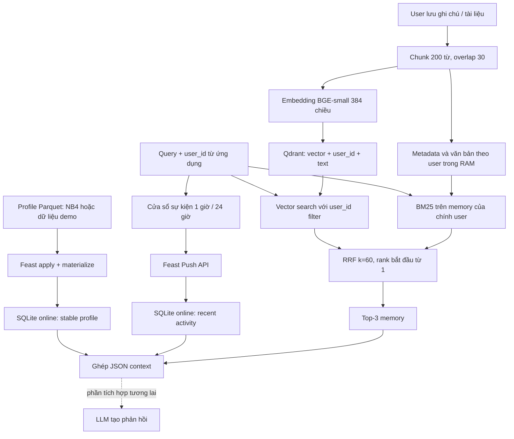

# Hybrid Memory cho trợ lý cá nhân tiếng Việt

## Mục tiêu và phạm vi POC

Trợ lý cần trả lời hai nhóm câu hỏi khác nhau: tài liệu nào liên quan đến câu
hỏi hiện tại, và người hỏi có hồ sơ, sở thích, hoạt động gần đây như thế nào.
Tôi chọn kiến trúc kết hợp Qdrant cho episodic memory và Feast cho stable profile
cùng recent activity. POC sử dụng nhánh Lite của Lab 19, chạy trên CPU, không
cần Docker, GPU hay khóa API. Dữ liệu minh họa là dữ liệu tổng hợp của lab.
Đầu ra của `recall()` là JSON context có feature và top-3 memory để một LLM có
thể sử dụng. POC chưa gọi LLM, nên không tuyên bố đã sinh được một bản summary
hay recommendation hoàn chỉnh.

## Quyết định 1: chunk theo cửa sổ có overlap

Tôi chia mỗi văn bản được lưu thành cửa sổ 200 từ, bước dịch 170 từ, tức overlap
30 từ. Một ghi chú ngắn vẫn là một chunk; văn bản dài có nhiều chunk với ID
riêng. Cách này đơn giản và có giới hạn rõ ràng về lượng văn bản được đưa vào
embedding. Phần overlap giữ lại nội dung gần ranh giới, tránh mất một câu giải
thích khi câu hỏi và bằng chứng nằm ở hai chunk kế tiếp. Tôi không gộp toàn bộ
lịch sử người dùng thành một vector, vì nội dung không liên quan sẽ pha loãng
biểu diễn và buộc re-embed cả lịch sử khi có ghi chú mới.

Đánh đổi là overlap tăng số vector, dung lượng payload và chi phí embedding.
Chunk quá nhỏ thiếu ngữ cảnh; chunk quá lớn làm top-K chứa nhiều đoạn thừa và
tốn context window của LLM. POC trả tối đa ba chunk, khoảng 600 từ nguồn, rồi
thêm feature JSON. Đây là giới hạn theo từ, chưa phải giới hạn theo token.
Trong sản phẩm thật cần dùng tokenizer của embedding model để tránh truncation
và thêm bước gộp chunk cùng tài liệu để giảm lặp. Semantic chunking có thể giữ
đoạn ý tốt hơn, nhưng tăng độ phức tạp và khó tái lập; tôi chọn baseline dễ đo
trước khi tối ưu bằng một golden set phù hợp.

## Quyết định 2: profile dạng bảng, memory trong vector store

Profile là feature dạng bảng vì ứng dụng cần đọc giá trị cụ thể, giải thích được
và cập nhật độc lập với embedding model. Hai feature view của bonus nằm trong
project `lab19_bonus`, không thêm view vào registry ba view của NB4.

| Feature | Entity | TTL view | Nguồn và cách cập nhật |
|---|---|---|---|
| `reading_speed_wpm` | `user_id` | 30 ngày | Profile Parquet, batch materialize |
| `preferred_language` | `user_id` | 30 ngày | Profile Parquet, batch materialize |
| `topic_affinity` | `user_id` | 30 ngày | Profile Parquet, batch materialize |
| `queries_last_hour` | `user_id` | 1 giờ | Đếm query trong RAM rồi Push API |
| `distinct_topics_24h` | `user_id` | 1 giờ | Số topic trong cửa sổ 24 giờ, Push API |

TTL của view recent activity mô tả độ mới của một snapshot, khác với cửa sổ
24 giờ dùng để tính distinct topics. TTL cũng không phải lịch refresh tự động.
Ứng dụng cần producer ghi snapshot mới. `recall()` ghi nhận query hiện tại rồi
push hai feature gần đây trước khi lookup, vì vậy context phản ánh cả query đó.
Profile được lấy từ dữ liệu NB4 khi có; demo trên thư mục sạch có fallback
profile tổng hợp cho hai user, không giả lập dữ liệu cá nhân thật.

Tôi bác bỏ phương án chỉ lưu cả episodic memory trong một embedding feature
view của Feast. Memory tăng theo từng ghi chú, cần top-K similarity và điều
kiện owner; profile có ít cột và thường thay đổi chậm hơn. Hai loại dữ liệu có
chu kỳ cập nhật, cách truy vấn và nhu cầu re-index khác nhau. Một feature vector
về sở thích có thể bổ sung trong tương lai, nhưng không thay thế văn bản nguồn
cần dùng để grounding và kiểm tra câu trả lời.

## Quyết định 3: ba mức freshness theo nhu cầu

Use case thứ nhất là lưu ghi chú rồi hỏi lại ngay: `remember()` thực hiện
embedding và upsert đồng bộ với `wait=True`, chỉ trả về sau khi point được ghi.
Query gần đây dùng Push API đồng bộ tại mỗi `recall()`. Mục tiêu thiết kế là
hiển thị thay đổi ngay trong lần lookup tiếp theo; POC không có phép đo để
cam kết SLA dưới một giây. Streaming ở đây là đường ghi event vào online
feature store, chưa có Kafka hay một stream processor phân tán.

Use case thứ hai là engagement của tài liệu: trong sản phẩm có thể tổng hợp
theo batch mỗi năm phút, chấp nhận chậm vài phút để giảm số write và chi phí
compute. Use case thứ ba là tốc độ đọc hoặc ngôn ngữ ưu tiên: refresh hàng ngày
hoặc khi user thay đổi cài đặt, thay vì xử lý mọi tương tác thành một cập nhật
profile. Hai lịch batch này là phương án kiến trúc; demo chưa triển khai scheduler.
Feast Push API được sử dụng theo [tài liệu chính thức](https://docs.feast.dev/reference/data-sources/push).

Nếu huấn luyện model với dữ liệu lịch sử, phải lưu các snapshot online vào
offline source cùng event timestamp. PIT join chỉ lấy giá trị tồn tại tại thời
điểm cần dự đoán và trong TTL. Latest join có thể dùng tương lai như NB8 minh
họa. POC chỉ push activity online, chưa lưu event log bền vững để huấn luyện;
vì vậy không tuyên bố đã có PIT training pipeline cho activity. Xem
[Feast PIT joins](https://docs.feast.dev/getting-started/concepts/point-in-time-joins).

## Truy xuất hybrid và ngữ cảnh tiếng Việt

Semantic search dùng cùng model 384 chiều cho memory và query. Hybrid chạy
BM25 trên memory của đúng user, lấy dense candidates có cùng owner rồi cộng
`1 / (60 + rank)` từ mỗi danh sách. Kết quả không có lexical score dương không
được thêm vào BM25 ranking, tránh đưa những tài liệu chỉ có score bằng không
vào fusion. Profile không dùng làm hard topic filter: sở thích cloud không
có nghĩa user không được hỏi PostgreSQL. Profile được ghép vào context để tầng
LLM có thể cá nhân hóa mà không loại bằng chứng cần thiết.

Tokenizer chuẩn hóa Unicode NFC, casefold và giữ dấu tiếng Việt cùng thuật ngữ
Anh. Đây là baseline theo chuỗi ký tự, không phải bộ tách từ tiếng Việt hoàn
chỉnh: "cơ sở dữ liệu" sẽ thành nhiều token. Pyvi hoặc underthesea có thể tăng
chất lượng từ ghép nhưng thêm dependency và cần benchmark trên query pha trộn
ngôn ngữ. Tôi giữ nguyên dấu trong semantic text; không tự sửa toàn bộ lỗi
telex vì có thể sửa sai tên riêng hoặc mã kỹ thuật. BGE-small thiên về tiếng
Anh nên demo paraphrase chỉ chứng minh đường chạy; muốn kết luận chất lượng
tiếng Việt cần thử model đa ngữ và re-index toàn bộ vector, không trộn hai
không gian embedding.

## Giới hạn và kiểm chứng

Dense retrieval áp dụng [Qdrant payload filter](https://qdrant.tech/documentation/search/filtering/)
theo `user_id`; BM25 dựng riêng từ memory của user. Demo lưu thêm một sentinel
riêng của user thứ hai và assert nó không xuất hiện trong năm context của user
thứ nhất. Đây là kiểm tra isolation trong code, không thay thế authentication:
API thật phải lấy user_id từ phiên đăng nhập đã xác thực. POC chưa triển khai
mã hóa, quyền chia sẻ, CRUD memory, xử lý prompt injection hay multi-device sync.

Qdrant và cửa sổ hoạt động ở RAM nên mất khi process kết thúc. Snapshot feature
ở SQLite không đủ phục hồi lịch sử cửa sổ sau restart. Demo tái tạo dữ liệu khi
chạy; hệ thật cần event log bền vững, consumer offset, idempotency và cơ chế xóa
theo yêu cầu người dùng. Không dùng semantic cache cho context cá nhân trong
bonus để tránh lặp lại lỗi namespace của NB7. Năm query demo kiểm tra đường
ghép memory, profile và activity, không đo chất lượng phản hồi LLM.
